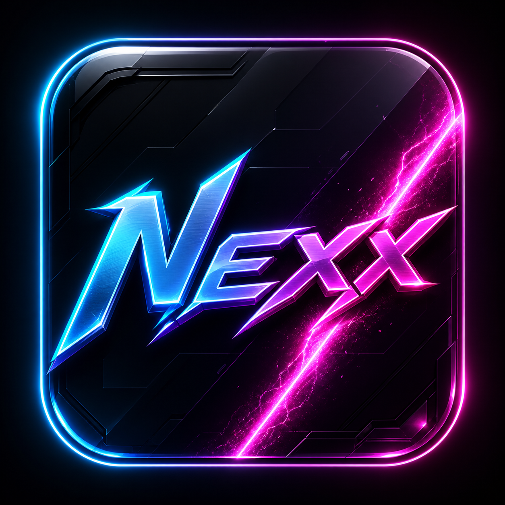
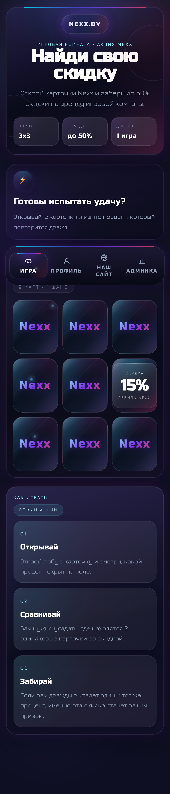
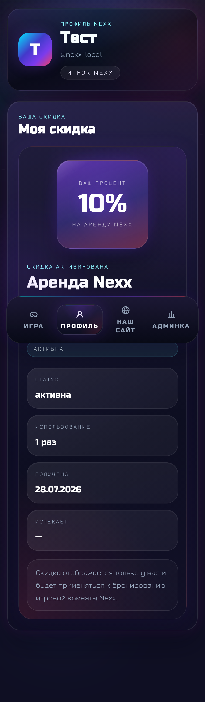
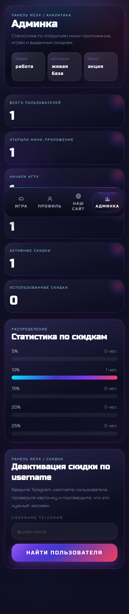
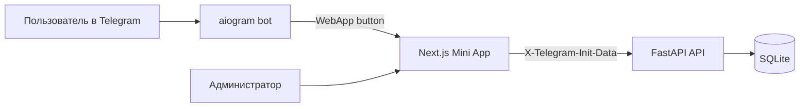

# Nexx Telegram Mini App

<div align="center">
  
  <h3>Неоновый Telegram Mini App для игровой комнаты Nexx</h3>
  <p>
    Игра на один шанс, персональная скидка на аренду, профиль игрока и админ-панель со статистикой
    в одном проекте на <code>Next.js</code>, <code>FastAPI</code>, <code>aiogram</code> и <code>SQLite</code>.
  </p>
  <p>
    <code>Next.js 15</code>
    <code>FastAPI</code>
    <code>aiogram 3</code>
    <code>SQLAlchemy 2.0</code>
    <code>SQLite</code>
    <code>Docker Compose</code>
  </p>
</div>

## Preview

<table>
  <tr>
    <td width="33%" align="center" valign="top">
      
      <br />
      <strong>Игра</strong>
      <br />
      <sub>3x3 поле, один шанс, живое состояние карточек и акцент на Telegram WebApp UX.</sub>
    </td>
    <td width="33%" align="center" valign="top">
      
      <br />
      <strong>Профиль</strong>
      <br />
      <sub>Персональная скидка фиксируется за пользователем и отображается как карточка приза.</sub>
    </td>
    <td width="33%" align="center" valign="top">
      
      <br />
      <strong>Админка</strong>
      <br />
      <sub>Статистика по открытиям, играм и скидкам плюс ручная деактивация по username.</sub>
    </td>
  </tr>
</table>

## Что Это

Nexx Telegram Mini App состоит из трех частей:

- `backend/` на `FastAPI` выдает API, хранит игры и скидки, валидирует Telegram `initData`.
- `frontend/` на `Next.js` отрисовывает игру, профиль и админку в mobile-first формате.
- `backend/bot/` на `aiogram` открывает Mini App через `/start` и WebApp-кнопки.

Пользователь приходит из Telegram, открывает 3x3 поле, ловит совпадение процентов и получает персональную скидку на аренду игровой комнаты Nexx.

## Ключевые Возможности

- Telegram-бот с `/start`, приветствием и `WebAppInfo` кнопкой для входа в Mini App.
- Игровое поле `3x3`, где раскладка процентов хранится только на backend.
- Один приз на пользователя: после успешной пары игра блокируется, а скидка сохраняется в базе.
- Профиль со статусом и параметрами выданной скидки.
- Админка со сводной аналитикой, распределением скидок и деактивацией по username.
- Локальный dev-режим через `dev-local` для запуска Mini App вне Telegram.

## Архитектура



## Стек

| Слой | Технологии |
| --- | --- |
| Frontend | `Next.js 15`, `React 19`, `TypeScript`, `Tailwind CSS`, `Framer Motion` |
| Backend API | `FastAPI`, `SQLAlchemy 2.0`, `Pydantic 2`, `Alembic` |
| Bot | `aiogram 3` |
| Data | `SQLite` в `backend/data/nexx_game.sqlite3` |
| Infra | `Docker`, `Docker Compose`, `Makefile` |

## Быстрый Старт

1. Создайте `.env` из шаблона:

```bash
cp .env.example .env
```

2. Заполните минимум:

- `BOT_TOKEN`
- `TELEGRAM_BOT_USERNAME`
- `WEBAPP_URL`
- `API_URL`
- `NEXT_PUBLIC_API_URL`
- `ADMIN_TG_IDS`
- `JWT_SECRET`

3. Поднимите проект:

```bash
docker compose up --build
```

После запуска:

- `backend-api` доступен на `http://localhost:8000`
- `frontend` доступен на `http://localhost:2023`
- `backend-bot` запускается как `python -m bot.main`

## Makefile

```bash
make dev
make prod
make down
make logs
make migrate
make build-backend
make build-frontend
```

## Локальная Разработка

### Backend

```bash
cd backend
python -m venv venv
source venv/bin/activate
pip install -r requirements.txt
mkdir -p data
alembic upgrade head
uvicorn app.main:app --reload
```

### Bot

```bash
cd backend
source venv/bin/activate
python -m bot.main
```

### Frontend

```bash
cd frontend
npm install
npm run dev
```

Production-like запуск frontend:

```bash
npm run build
npm start
```

## Production Compose

```bash
docker compose -f docker-compose.prod.yml up --build -d
```

## Переменные Окружения

Основные значения лежат в `.env.example`:

| Переменная | Назначение |
| --- | --- |
| `BOT_TOKEN` | токен Telegram-бота |
| `TELEGRAM_BOT_USERNAME` | username бота без `@` |
| `TELEGRAM_PROXY` | необязательный proxy только для bot traffic |
| `WEBAPP_URL` | публичный HTTPS URL Mini App |
| `API_URL` | публичный URL backend API |
| `NEXT_PUBLIC_API_URL` | URL API для frontend |
| `DATABASE_URL` | строка подключения к SQLite |
| `ADMIN_TG_IDS` | Telegram ID администраторов через запятую |
| `JWT_SECRET` | секрет для backend |
| `APP_ENV` | `development` или `production` |
| `CORS_ORIGINS` | разрешенные origins через запятую |
| `DISCOUNT_EXPIRES_DAYS` | необязательный TTL скидки в днях |

`DISCOUNT_EXPIRES_DAYS` можно оставить пустым. Тогда скидка не истекает автоматически.

## Игровая Логика

- Размер поля: `3x3`, всего `9` карточек.
- Игра выдается один раз на пользователя.
- После нахождения совпадающей пары создается запись в `discounts`.
- Повторный запуск после выигрыша переводит пользователя в `blocked` состояние.
- Выигрышный процент выбирается по весам:

| Скидка | Вес |
| --- | ---: |
| `5%` | `15` |
| `10%` | `35` |
| `15%` | `35` |
| `20%` | `10` |
| `25%` | `5` |

## Безопасность

- Проценты карточек не уходят на frontend, пока карточка не открыта.
- Вся раскладка живет на backend и в SQLite.
- Mini App запросы требуют `X-Telegram-Init-Data`.
- Telegram auth валидируется на backend через `BOT_TOKEN`.
- Для локальной разработки поддерживается `dev-local`, если `APP_ENV != production`.
- На игровые endpoints навешан базовый rate limit.

## Основные Endpoints

- `GET /api/me`
- `POST /api/game/start`
- `GET /api/game/state`
- `POST /api/game/open-card`
- `GET /api/discounts/my`
- `GET /api/admin/stats`
- `POST /api/admin/users/{user_id}/deactivate-discount`
- `PATCH /api/admin/discounts/{discount_id}/status`

## Структура Проекта

```text
backend/
  app/
  bot/
  alembic/
frontend/
  app/
  components/
  public/
docs/
  screenshots/
docker-compose.yml
docker-compose.prod.yml
Makefile
README.md
```

## Docker Images

```bash
docker build -t nexx-backend:latest ./backend
docker build -t nexx-frontend:latest ./frontend
```

## Что Важно Для UI

- интерфейс сделан mobile-first под Telegram WebApp;
- нижняя навигация фиксирована и рассчитана на большой палец;
- визуальный стиль строится вокруг неоновой палитры Nexx;
- игра, профиль и админка используют единый стеклянный дизайн и акцентные градиенты.
